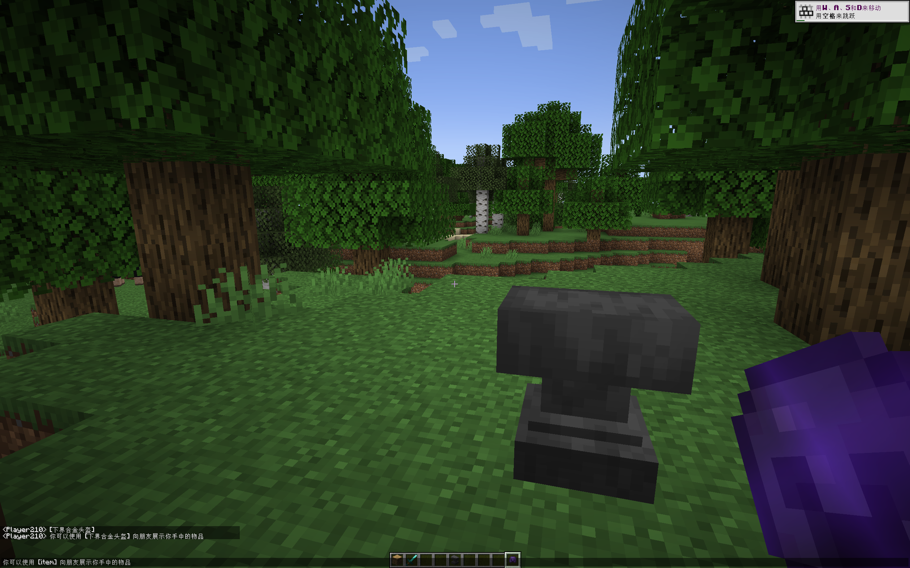

<!-- 项目徽章（可根据实际替换链接和图片） -->
<div align="center">
  <a href="https://github.com/PhantomPixel-0418/ShowMyItem">
    
  </a>

  <h3 align="center">Show My Item</h3>

  <p align="center">
    在聊天中优雅地展示你手中的物品 —— 让炫耀更简单！
    <br />
    <a href="https://github.com/PhantomPixel-0418/ShowMyItem"><strong>探索文档 »</strong></a>
    <br />
    <br />
    <a href="https://modrinth.com/mod/showmyitem">查看 Modrinth 页面</a>
    ·
    <a href="https://github.com/PhantomPixel-0418/ShowMyItem/issues">报告 Bug</a>
    ·
    <a href="https://github.com/PhantomPixel-0418/ShowMyItem/issues">请求功能</a>
  </p>
</div>

<!-- 目录 -->
<details>
  <summary>目录</summary>
  <ol>
    <li><a href="#关于项目">关于项目</a>
      <ul>
        <li><a href="#技术栈">技术栈</a></li>
      </ul>
    </li>
    <li><a href="#开始使用">开始使用</a>
      <ul>
        <li><a href="#前置要求">前置要求</a></li>
        <li><a href="#安装">安装</a></li>
      </ul>
    </li>
    <li><a href="#使用说明">使用说明</a></li>
    <li><a href="#路线图">路线图</a></li>
    <li><a href="#贡献">贡献</a></li>
    <li><a href="#许可证">许可证</a></li>
    <li><a href="#联系方式">联系方式</a></li>
    <li><a href="#致谢">致谢</a></li>
  </ol>
</details>

## 关于项目



**Show My Item** 是一个轻量级的 Minecraft Fabric 模组，为聊天增加了一个有趣的小功能：当你在聊天中输入 `[item]` 时，它会自动替换为你手中持有的物品名称，并且其他玩家将鼠标悬停在该名称上时，可以**直接看到该物品的完整详情**（名称、附魔、耐久等）。

**它解决了什么问题？**

- 不用再手动输入复杂的物品名，或让朋友猜测你拿的是什么。
- 悬停即展示，无需额外命令，交流更直观。
- 纯粹为了和朋友分享、炫耀，无任何作弊或破坏平衡的元素。

**为什么选择它？**

- **简单**：无需配置，安装即用。
- **轻量**：仅服务端需要安装，对性能无影响。
- **兼容**：基于 Fabric API，与大多数模组兼容。

当然，一个模组不可能满足所有人，如果你有任何建议，欢迎通过 Issues 或 Pull Request 提出。

<p align="right">(<a href="#top">回到顶部</a>)</p>

### 技术栈

- [Minecraft 1.21.4](https://www.minecraft.net)
- [Fabric Loader](https://fabricmc.net/) (>=0.16.9)
- [Fabric API](https://modrinth.com/mod/fabric-api) (>=0.119.4)
- Java 21

<p align="right">(<a href="#top">回到顶部</a>)</p>

## 开始使用

要在你的服务器（或单人游戏）上使用此模组，请按照以下步骤操作。

### 前置要求

- **Minecraft 1.21.4** 服务器或客户端（如果单人游玩）。
- **Fabric Loader** 0.16.9 或更高版本。
- **Fabric API**（服务端和客户端都需要，但本模组仅在服务端运行，客户端若未安装则悬停效果无法显示）。

### 安装

1. **下载模组**  
   从 [Modrinth](https://modrinth.com/mod/showmyitem) 或 [GitHub Releases](https://github.com/PhantomPixel-0418/ShowMyItem/releases) 下载最新版 JAR 文件。

2. **放置模组**  
   将 JAR 文件放入服务端的 `mods` 文件夹。  
   *如果单人游玩，则放入客户端的 `mods` 文件夹。*

3. **启动游戏/服务器**  
   无需任何额外配置，模组会自动生效。

<p align="right">(<a href="#top">回到顶部</a>)</p>

## 使用说明

### 基本用法

1. 确保你手中持有任意物品（空手时会显示“空手”提示）。
2. 在聊天框中输入包含 `[item]` 的消息，例如：

    ```text
    看看我的这个！[item]
    ```

3. 发送后，消息中的 `[item]` 会被替换为你的主手物品，格式为 `[物品名]`。
4. 其他玩家将鼠标悬停在 `[物品名]` 上，即可看到该物品的详细工具提示（附魔、耐久、自定义名称等）。

### 效果示例

*发送前：*
> 看看我的这个！[item]

*发送后（假设手中是一把附魔钻石剑）：*
> 看看我的这个！[钻石剑]
>
> *鼠标悬停在“[钻石剑]”上，显示：*
>
> ```
> 钻石剑
> 锋利 IV
> 耐久 III
> 等等...
> ```

### 注意事项

- 该模组设计为 **仅服务端加载** 即可生效，客户端无需安装。但若客户端未安装，鼠标悬停时可能无法正确渲染物品详情（此时会显示一个简单的物品 ID 文本）。
- 若想在单人游戏中测试悬停效果，请将模组也放入客户端 `mods` 文件夹

<p align="right">(<a href="#top">回到顶部</a>)</p>

## 路线图

- [ ] 支持副手物品显示（如 `[offhand]` 占位符）
- [ ] 添加配置选项，允许自定义显示格式（例如是否显示数量）
- [ ] 支持更多消息类型（如 /tell 私聊）
- [ ] 本地化支持（多语言）

查看 [开放问题](https://github.com/PhantomPixel-0418/ShowMyItem/issues) 以了解完整的功能请求列表和已知问题。

<p align="right">(<a href="#top">回到顶部</a>)</p>

## 贡献

贡献是开源社区如此神奇的原因。**任何你做出的贡献都将受到极大的赞赏**。

如果你有改进建议，请 fork 本仓库并创建一个 pull request。你也可以在 Issues 中标记“enhancement”来提出建议。不要忘记给项目点一个 star！感谢！

1. Fork 本仓库
2. 创建你的功能分支 (`git checkout -b feature/AmazingFeature`)
3. 提交你的更改 (`git commit -m 'Add some AmazingFeature'`)
4. 推送到分支 (`git push origin feature/AmazingFeature`)
5. 打开一个 Pull Request

<p align="right">(<a href="#top">回到顶部</a>)</p>

## 许可证

基于 MIT 许可证分发。详见 `[LICENSE](/LICENSE)` 文件。

<p align="right">(<a href="#top">回到顶部</a>)</p>

## 联系方式

项目链接: [https://github.com/PhantomPixel-0418/ShowMyItem](https://github.com/PhantomPixel-0418/ShowMyItem)

<p align="right">(<a href="#top">回到顶部</a>)</p>

## 致谢

这个 README 模板借鉴了以下优秀项目：

- [Best-README-Template](https://github.com/othneildrew/Best-README-Template)
- [Fabric Wiki](https://fabricmc.net/wiki/start)

<p align="right">(<a href="#top">回到顶部</a>)</p>
